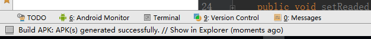
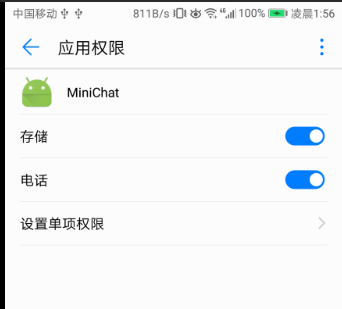
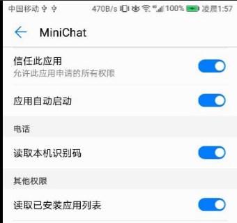

# 安装部署说明
**小组成员: 陈锐煌、蔡桐钊、陈海涛、郑斯达**
## 前端
首先需要先导出或者下载MiniChat的apk, 最低的Android版本为4.0.

导出apk的方式为用Android Studio打开项目后,工具栏的**Build**->**Build APK**,导出完成时在AS的下方能看到如下提示



然后在项目文件夹下的**app**->**build**->**outputs**->**apk**下看到生成了**app-debug.apk**

安装完成后,可以看到出现了MiniChat的图标


接着需要到设置或手机中的其他软件管理软件对MiniChat进行授权,特别注意的是，存储权限必须要给




授权后，软件便可以正常运行。

## 服务端（Linux）
1. 克隆仓库到本地
```
git clone https://github.com/SYSUMiniChat/MiniChatServer.git
```

2. 安装`virtualenv`并激活
```
pip install virtualenv
virtualenv venv
source venv/bin/activate
```

3. 安装`Flask`和腾讯信鸽（`xinge_push`）等相关依赖
```
pip install -r requirements
```

4. 运行
```
python server.py 
```

> 运行前需要在 MiniChatServer 目录下创建一个 `server.conf` 配置文件

```
[xinge]
accessId = 腾讯信鸽 access id
secretKey = 腾讯信鸽 secret key

[email]
username = 邮箱账户
password = 邮箱密码

[mysql]
databaseUrl = 数据库 url

[minichat]
admin = 管理员账号
```