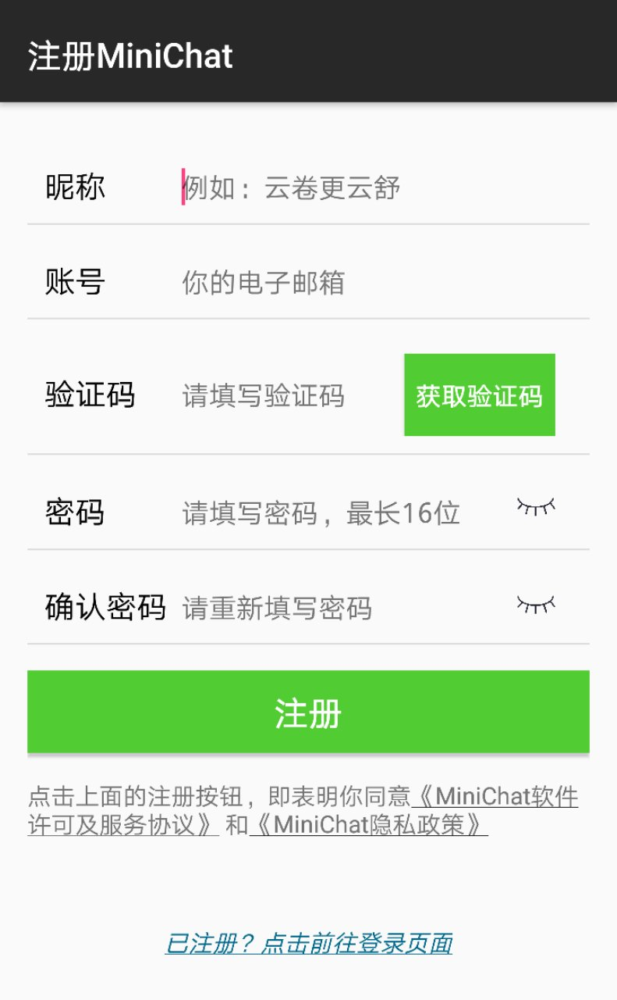
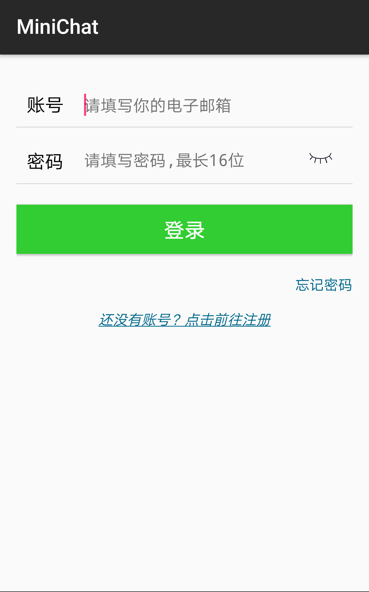

# 用户使用手册

## 引言
### 编写目的
该手册用于指导初次使用微聊的用户学会正确的操作方法，并使用上应用的完整功能。
### 项目背景
项目完成团队为中山大学软件工程专业大三学生，成员为蔡桐钊、陈海涛、陈锐煌、郑斯达。

## 软件概述
### 概述
MiniChat微聊是一款简易版的聊天工具，包括登录注册，添加好友以及私聊等功能。

### 功能

 *	注册账号：使用邮箱账号注册，并需要获取验证码并通过验证。

 * 登录账号：使用已注册的账号和对应的密码进行登录。
 
 * 重置密码：忘记登录密码，可以凭据已注册的账号并通过验证码的验证之后，重置密码。
 
 * 添加好友：在通讯录页面，通过输入账号来查询好友，如果账号存在，会显示对方的信息详情，并可添加好友到通讯录中。如果账号不存在，则提示用户。
 * 与好友聊天：在最近联系人页面，点击好友图标，会跳转到聊天页面，在输入框中输入想要发送的文字，点击发送按钮即可发送消息。
 * 修改个人信息：在个人信息页面，可以修改头像、昵称、性别、地区、签名以及登录密码。账号一旦注册，不可修改。

## 运行环境
安卓操作系统，API19以上，给定自启动、存储权限，开机模式下。

## 安装方式
直接点击apk文件进行安装。

## 非常规操作
 * 关机状态
 * 不给文件读取权限

## 用户操作举例

### 用户注册

 * 点击登录页面下方的“还没有账号？点击前往注册”，跳转到注册页面
 * 输入昵称、账号（仅限电子邮箱）
 * 点击获取验证码按钮，验证码会发送到邮箱账号
 * 输入邮箱收到的验证码，验证码为6位数字
 * 输入密码和确认密码，点击右边的“闭眼”图标，可以切换密码可见状态
 * 点击注册按钮，如果注册成功则跳转到登录页面，如果注册失败则提示“邮箱已注册”
 
 

### 用户登录

 * 输入电子邮箱账号和对应的密码
 * 点击登录按钮，若账号已注册且密码正确，则登录成功，若登录失败，则弹出失败原因。
 
 		

### 最近联系人页面

 * 该页面显示最近与你联系的好友的昵称、头像、最后一条聊天记录以及最后一条消息的时间。

 * 单击其中任意一项，跳转到好友聊天页面，并显示与该好友的聊天记录。

 * 长按其中任意一项，弹出对话框，提示是否删除该聊天记录。

### 通讯录页面

 * 点击右上角加号，跳转到查找用户页面，输入用户账号，可进行搜索。

 * 在搜索框内输入好友昵称，可查找通讯录中的好友。

 * 点击“新的朋友”，跳转到好友请求列表页面，显示所有的好友请求信息。点击“去看看”，跳转到好友信息页面，点击下方的“同意”或“拒绝”按钮，回复好友的请求操作。

 * 单击任意一个好友。跳转到好友信息页面，点击“发送消息”按钮，跳转到好友聊天页面，可进行下一步的聊天操作。

 * 长按任意一个好友，弹出对话，提示是否删除该好友。

### 个人信息页面

 * 点击“头像”一栏，打开本地相册文件，选择图片设置头像。点击头像，查看大图。

 * 点击“昵称”、“地区”、“Mini签名”这几栏，都会跳转到修改页面，输入新的内容后，点击保存按钮即可修改。若取消修改，点击左上方返回按钮。

 * 点击“Mini号”，提示“Mini号不可修改喔~”

 * 点击“性别”一栏，弹出对话框，选择“男”或“女”，点击“确定”或“取消”，进行对应的修改操作。

 * 点击“修改密码”一栏，弹出对话框，提示修改密码前要先填写原密码，输入正确密码后，点击“确认”按钮，跳转到设置密码页面。在这里输入新密码并确认密码后，点击保存按钮，若密码前后一致且修改成功，则跳转到个人信息页面。

 * 点击“退出登录”一栏，弹出对话框，提示是否确定退出当前账号，点击“确定”或“取消”，进行对应的修改操作。

### 忘记密码页面
  
 * 输入要找回密码的账号，并点击“获取验证码”按钮，输入收到的验证码后，点击“下一步”文字，若验证成功，跳转到设置密码页面。修改操作同上。